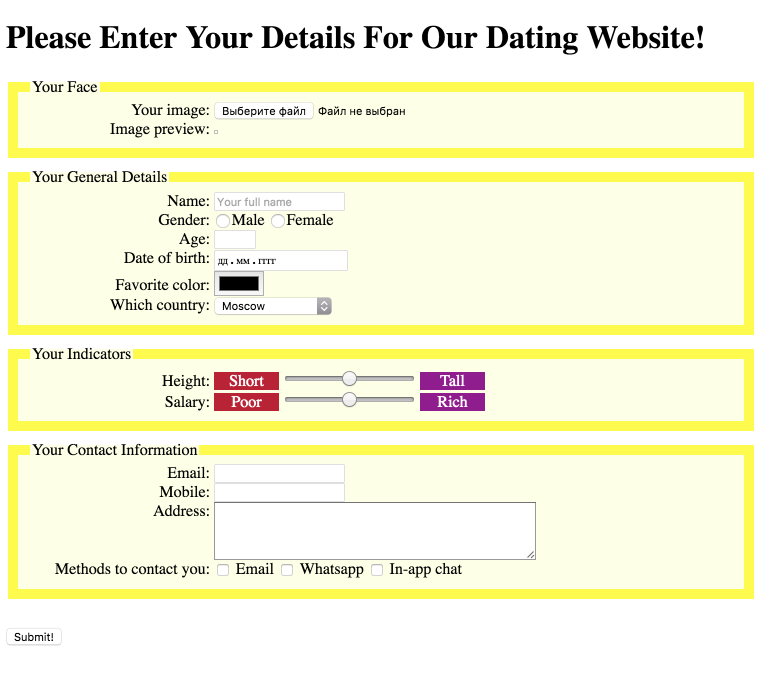
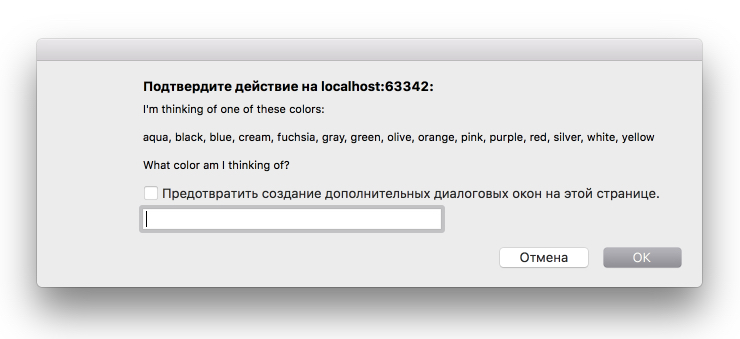

# Coursera-HTML-CSS-JavaScript
Done asessment tasks of <a href="https://www.coursera.org/learn/html-css-javascript">HTML, CSS and JavaScript course</a> of  The Hong Kong University of Science and Technology.
  
1 week - [Dating Web Site](https://rawgit.com/anelliabe/Coursera-HTML-CSS-JavaScript/master/Dating%20Web%20Site%20Assessment.html)
 

  
2 week - [Guessing Color Game](https://rawgit.com/anelliabe/Coursera-HTML-CSS-JavaScript/master/Task2%20(Color%20Guessing%20Game).html)

